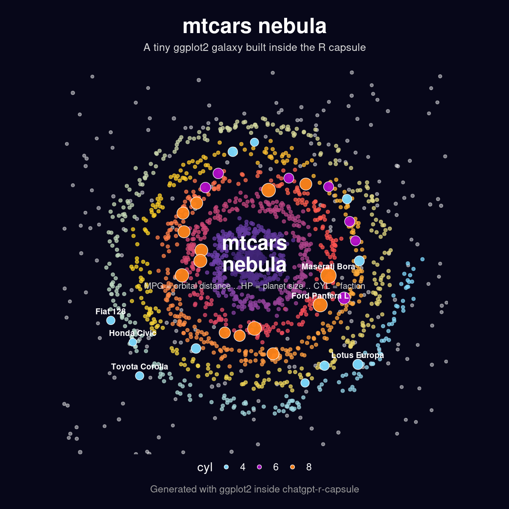

# chatgpt-r-capsule

Run R in ChatGPT web or app.

Builds a self-contained capsule that ChatGPT can use to run R, run scripts and make plots.




## Requirements

Local build requirements:

- Docker
- ChatGPT Plus/Pro/Enterprise

## Build the capsule

```bash
make capsule
```

This creates a tarball under:

```text
dist/chatgpt-r-capsule-4.6.0-debian12-x86_64.tar.gz
```

## Upload to ChatGPT

Upload the generated capsule tarball to a ChatGPT conversation or project.

Use this prompt:

```text
I uploaded an R runtime capsule. Please extract it and make it available at:

/opt/chatgpt-r-capsule

Use shell/container commands if the notebook-side Python process cannot write to /opt. If needed, extract elsewhere and symlink or copy it to /opt/chatgpt-r-capsule.

Then verify R works with:

/opt/chatgpt-r-capsule/Rscript-capsule --version

Next, make two plots: a classic plot using the iris dataset and then a fun, whimsical spiral-galaxy plot using mtcars, where the cars are treated like planets or stars. Save the plots as PNG and display them inline through the notebook output/display mechanism.
```

## Included R packages

Packages included in the main capsule are listed in `packages.txt` and you can add or remove as you see fit.

To add packages without rebuilding the entire capsule, use the `make package` shortcut. Examples:

```bash
make package PKG=cran::jsonlite
make package PKG=/path/to/package
```

Package bundles are written under:

```text
dist/packages/
```

## Compatibility note

The project targets ChatGPT's current Linux x86_64 code-execution environment, which may change in the future.